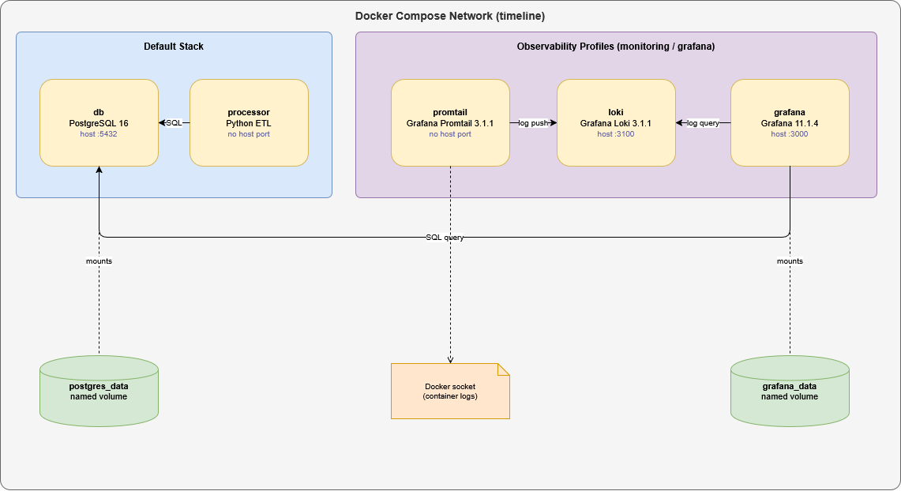

# Architecture

This document defines the overall project architecture for the Timeline repository.

## Diagram

The diagram source is [docs/architecture.drawio](architecture.drawio) and can be opened in VS Code (Draw.io Integration extension) or at [app.diagrams.net](https://app.diagrams.net).

The diagram covers all Docker Compose services, their profiles, named volumes, and the key data flows between components.

## Scope

The repository is organized as a Docker Compose based system with one application service and supporting infrastructure services:

- `processor`: the Python ETL service
- `db`: PostgreSQL for persistent application data
- `loki`: log storage for the monitoring stack
- `promtail`: log shipping into Loki
- `grafana`: dashboards and queries for observability

## Runtime Topology

Docker Compose is the main orchestration layer. Services are started through profiles so the default stack stays small, while observability can be enabled when needed.

### Default Stack

Without any profile, Compose starts:

- `db`
- `processor`

The processor depends on PostgreSQL and reads its database connection from `PROCESSOR_DATABASE_URL` inside the container, sourced from the host-side `.env` variable of the same name through Docker Compose environment mapping.

### Observability Stack

The monitoring services are grouped into two profiles:

- `monitoring`: starts Loki and Promtail
- `grafana`: starts Grafana

For log exploration through Grafana, both profiles are required because Grafana queries Loki.

## Ports

The following container ports are published on the host and can be reached by external tools:

| Service | Container Port | Host Port | `.env` variable | Purpose |
| --- | --- | --- | --- | --- |
| PostgreSQL (`db`) | 5432 | `DB_HOST_PORT` (default 5432) | `DB_HOST_PORT` | Database access for the processor and external clients |
| Grafana (`grafana`) | 3000 | `GRAFANA_HOST_PORT` (default 3000) | `GRAFANA_HOST_PORT` | Dashboard and exploration UI |

Loki's port 3100 is exposed only within the Docker Compose network so that Promtail and Grafana can reach it. It is not published on the host.

The processor and Promtail do not publish host ports.

## Data Flow

1. The processor connects to PostgreSQL through the Compose network.
2. Promtail reads container logs from Docker and forwards them to Loki.
3. Grafana connects to PostgreSQL and Loki through the configured datasources.

## Volumes

Persistent data is stored in named volumes:

- `postgres_data`: PostgreSQL data directory
- `grafana_data`: Grafana state and local storage

## Service Documentation

The processor service architecture is documented separately in [docs/PROCESSOR.md](PROCESSOR.md).

## Configuration Documentation

The runtime configuration model is documented in [docs/CONFIGURATION.md](CONFIGURATION.md).

Export configuration is documented in [docs/EXPORTS.md](EXPORTS.md).

The processor container expects the active configuration file at `/app/config/config.yaml`.

## Database Documentation

The relational schema and model definitions are documented in [docs/DATABASE.md](DATABASE.md).

## Scripts Documentation

Helper scripts for database access and other operational tasks are documented in [docs/SCRIPTS.md](SCRIPTS.md).