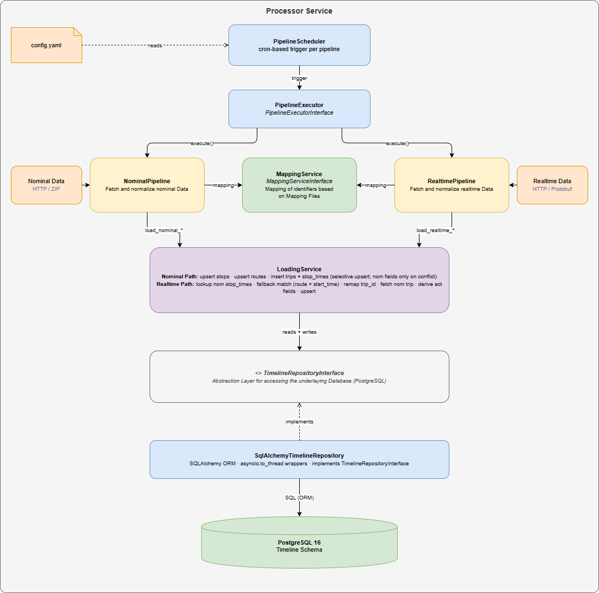

# Processor Architecture

This document describes the architecture of the `processor` service.

For the overall repository architecture, see [docs/ARCHITECTURE.md](ARCHITECTURE.md).

## Diagram

The diagram source is [docs/processor.drawio](processor.drawio) and can be opened in VS Code (Draw.io Integration extension) or at [app.diagrams.net](https://app.diagrams.net).

## Purpose

The processor is the Python service responsible for the Timeline ETL workload. It is structured as a containerized application and runs as a module entrypoint through `python -m processor`.

Its runtime logic is based on two coordinated data pipelines per instance:

- nominal pipeline for planned schedule data
- realtime pipeline for observed operational data

## Packaging Layout

The processor project uses a `src` layout and is managed as a standalone Python package.

- Python project root: `processor/`
- Application package: `processor/src/processor/`
- Runtime entrypoint: `processor.__main__:main`
- Build metadata: `processor/pyproject.toml`

## Runtime Characteristics

The service runs inside Docker and receives its database connection through the `PROCESSOR_DATABASE_URL` environment variable inside the container.

The scheduler timezone is configured through `PROCESSOR_TIMEZONE` (IANA timezone string like `Europe/Berlin`).
If not set, `UTC` is used.

The scheduler configuration is read from a YAML file mounted in the container at `/app/config/config.yaml`.

Before the scheduler starts, the processor executes Alembic migrations to `head` during startup.
If migration execution fails, service startup fails fast and no pipeline scheduling begins.

The container is intentionally minimal:

- no host port is published
- access happens through the internal Compose network
- startup depends on PostgreSQL health readiness

## Processing Model

The processor maintains pipeline execution per instance (tenant-like scope).

An instance represents an isolated operational domain. Data produced for one instance must remain separable from all other instances in:

- persistence (database records)
- analytics and visualizations (dashboards)

### Pipeline Processing Scope

Pipelines are responsible for extraction and transformation only.

Pipeline runs may execute asynchronously and concurrently across multiple instances.
Pipeline implementations must therefore be safe to execute in parallel without shared mutable state across instances.

For each run, a pipeline:

1. fetches source data from the configured endpoint
2. normalizes the extracted payload into the internal canonical format
3. hands normalized records to the central load service

Loading into PostgreSQL is not performed directly by pipeline implementations.
Pipelines must not query or write the database directly.

### Central Mapping Service

The central mapping service is invoked by the pipeline before transformation and matching steps that require identifier translation.

The service must be independent per instance because pipelines may run asynchronously and multiple instances may run at the same time.
No cross-instance mutable mapping state may be shared at runtime.

Its responsibilities are:

- read mapping file paths from pipeline configuration
- load each mapping source into in-memory dictionaries of `key -> value`
- provide normalized mapping lookup APIs to the pipeline runtime
- provide mapping-to-loading conversion methods so pipelines can pass mapped `TripRecord` and `StopTimeRecord` objects to the loading service
- apply wildcard mapping keys (for example `*`) according to mapping resolution rules

Mapping ownership decision:

- mapping file parsing and mapping application are owned by the central mapping service
- the central load service receives already mapped identifiers and focuses on persistence and matching

### Central Matching Service

The central matching service is invoked by the loading service when importing a realtime update with trip IDs not matching the nominal trip IDs.

The service can be called independly per instance as the pipelines may run asynchronozsly and multiple instances may run at the same time. As a database connection will be required,
repository instance of the loading service is shared.

Its responsibilies are:

- take up the trip record by the loading service
- match the trip against the route ID, the operation day date and the scheduled start time
- return the matched trip ID

The matching service offers an API which can be served by different sets of parameters. Only those parameters which are handed to the matching service are considered during matching. Too few served parameters may lead to an unambiguous match of multiple trips. Following parameters are available:

- `instance_id`: (mandatory) the instance ID the realtime pipeline belongs to
- `operation_day_date`: (mandatory) the operation day date the realtime trip belongs to
- `route_id`: (optional) the route ID for the nominal trip lookup
- `scheduled_start_time`: (optional) the start time (first departure time) for the nominal trip lookup
- `scheduled_end_time`: (optional) the end time (last arrival time) for the nominal trip lookup
- `scheduled_start_stop_id`: (optional) the first stop ID for the nominal trip lookup
- `scheduled_end_stop_id`: (optional) the last stop ID for the nominal trip lookup 

Typical matching sets should contain at least (`route_id`, `scheduled_start_time`, `scheduled_start_stop_id`) or (`scheduled_start_time`, `scheduled_start_stop_id`, `scheduled_end_time`, `scheduled_end_stop_id`) to find a proper match.

During the matching process the parameters are expanded or relaxed a little in order to compensate smaller data quality issues:

- `scheduled_start_time` and `scheduled_end_time` are expanded with a time frame of 60s around
- If `scheduled_start_stop_id` or `scheduled_end_stop_id` use global IDs, the IDs are reduced to level 3 (station) 

### Central Load Service

The central load service owns all load-phase responsibilities:

- receiving normalized data from pipelines and loading it into the database
- being the only service allowed to interact with PostgreSQL directly for both reads (queries/matching lookups) and writes (insert/upsert/update)
- applying **insert-or-ignore** persistence for nominal trips and stop times (see write strategy below)
- applying upsert-based persistence for nominal stops and all realtime data
- handling matching workflows when realtime records arrive without corresponding nominal records
- resolving trip identity after mapped identifiers are provided by the central mapping service
- ensuring atomic database behavior even when asynchronous pipeline runs call the service concurrently
- resolving realtime `StopTimeEvent` values by preferring absolute timestamps and using delay-as-offset-to-nominal fallback
- enforcing realtime update scope so conflict updates only touch `act_*` and `schedule_relationship`
- deriving `dim_trips.act_start_time` and `dim_trips.act_end_time` from first/last nominal departure rows ordered by `stop_sequence` (with nominal departure tie-break), with nominal departure fallback when realtime values are missing
- persisting `dim_trips.act_end_time` only after the derived end candidate timestamp is reached (`<= now`), otherwise keeping it `NULL`

#### Nominal Data Processing

Nominal trips (`dim_trips`) and nominal stop times (`fact_stop_times`) use a **selective upsert** strategy that protects realtime fields:

- When a nominal trip or stop-time row is pushed by the nominal pipeline and no matching row exists yet, the full row is inserted.
- When a matching row already exists (same `instance_id`, `operation_day_date`, `trip_id`, and optionally `stop_id` / `stop_sequence`), **only nom fields and route metadata are updated**; realtime fields are never touched.

Fields updated on conflict for `dim_trips`:
`route_id`, `route_name`, `concessionaire_id`, `concessionaire_name`, `operator_id`, `operator_name`, `nom_start_time`, `nom_end_time`, `nom_start_stop_id`, `nom_end_stop_id`, `nom_total_distance`

Fields intentionally excluded from nominal conflict updates for `dim_trips`:
`act_start_time`, `act_end_time`, `act_total_distance`, `schedule_relationship`

Fields updated on conflict for `fact_stop_times`:
`distance_from_start`, `nom_arrival_time`, `nom_departure_time`

Fields intentionally excluded from nominal conflict updates for `fact_stop_times`:
`act_arrival_time`, `act_departure_time`, `schedule_relationship`

This design handles the following important scenarios:
- **Nominal re-runs**: a trip that was inserted during an earlier nominal run and has since been enriched by the realtime pipeline keeps all its realtime data intact.

Nominal stops (`dim_stops`) continue to use full upsert semantics because stop metadata (name, coordinates) is expected to change across feed versions.

Atomicity and asynchronous concurrency requirements:

- execute each load request in an explicit database transaction
- define the transaction unit as one instance and one pipeline-run payload
- include upsert, matching, and related writes in the same transaction boundary
- commit only after all operations succeed, otherwise roll back the entire transaction
- use deterministic concurrency control during matching and upsert, for example row-level locks (`SELECT ... FOR UPDATE`) or PostgreSQL advisory locks scoped by instance and trip identity
- treat deadlocks and serialization conflicts as retriable errors with bounded retries

#### Realtime  Data Processing

After receiving raw realtime records from a pipeline and fetching the corresponding nominal stop times from the database, the loading service executes the following post-processing steps in order before writing to the database.
Pipelines must not perform any of these steps themselves; they only supply identity fields and the raw event data.

If a trip is not found by its ID in the nominal data, the MatchingService is used to derive a matching trip ID.

**Step 1 — Nominal baseline merge and delay propagation** (`_apply_nominal_baseline`)

Iterates the full nominal stop sequence in ascending `stop_sequence` order.

- For each nominal stop with an explicit realtime update: replace the placeholder nominal times with the real scheduled times from the database, and track the effective delay (arrival and departure tracked independently).
  - If an absolute timestamp was supplied, the effective delay is `round((act_time − nom_time).total_seconds())`.
  - If only `delay_seconds` was supplied, that value is used as the effective delay.
- For each nominal stop without an explicit realtime update, if at least one preceding explicit update exists: synthesize a `StopTimeRecord` carrying the tracked `arrival_delay_seconds` / `departure_delay_seconds` with `schedule_relationship = "SCHEDULED"` and `act_arrival_time` / `act_departure_time` left `None` (resolved downstream). Explicit update data is always authoritative and is never overwritten by a propagated value.
- Stops that precede the first explicit update in the nominal sequence receive no propagated record.
- For nominally unknown trips (no nominal stop times in the database): the realtime records are passed through as-is; no baseline merge or propagation is performed.

**Step 2 — Realtime timestamp normalization** (`_normalize_realtime_stop_times`)

For every stop-time record:

- If an absolute `act_arrival_time` or `act_departure_time` was provided, it is used directly.
- If only `arrival_delay_seconds` / `departure_delay_seconds` is present, the actual time is resolved as `nom_*_time + timedelta(seconds=delay_seconds)`.
- If only one side (arrival or departure) is present after resolution, it is mirrored to the missing side so both `act_arrival_time` and `act_departure_time` are always in sync for the same stop.

**Step 3 — Trip boundary derivation** (`_derive_realtime_trip_fields`)

Derives all trip-level boundary fields from the ordered stop-time data.

- `nom_start_time` / `nom_end_time`: taken from `nom_departure_time` of the first / last nominal stop (falling back to the first / last normalized realtime stop for nominally unknown trips).
- `nom_start_stop_id` / `nom_end_stop_id`: `stop_id` of the first / last nominal stop.
- `nom_total_distance`: maximum `distance_from_start` across all nominal stops.
- `act_start_time`: `act_departure_time` of the first realtime stop (falls back to `nom_start_time` when absent).
- `act_end_time`: `act_departure_time` of the last realtime stop, but only written when that timestamp is `<= now`; otherwise kept `NULL` until the trip end is in the past.
- `act_total_distance`: maximum `distance_from_start` across all normalized realtime stops.

Matching workflow for realtime-to-nominal trip resolution:

1. Try direct trip ID match first.
2. If a direct trip ID match exists, accept it and stop matching.
3. If no direct trip ID match exists, run fallback matching:
   - use mapped actual route ID from the central mapping service
   - use mapped actual stop IDs from the central mapping service
   - find a nominal trip where:
     - mapped route ID equals nominal route ID
     - actual trip start time equals nominal trip start time
     - mapped stop IDs equal nominal stop IDs in the same sequence
4. If a fallback candidate satisfies all conditions above, treat that nominal trip as the final matched trip.
5. Final fallback when start time and start date are unavailable in realtime input:
  - match by mapped stop IDs in the same sequence
  - validate that actual departure times match nominal departure times within a tolerance window of `-10 minutes` to `+30 minutes`
  - if multiple nominal trips satisfy the fallback criteria, select the best match with the smallest arrival/departure time deviation
  - if all stops satisfy sequence and tolerance conditions, treat that nominal trip as the final matched trip

Realtime information supplied explicitly by the pipeline always takes precedence over any synthesized or propagated value.

#### Pipeline Priorities
Especially when configuring multiple realtime pipelines, there might be the case when two pipelines deliver data for the same nominal trip. To avoid both pipelines overwriting each other's realtime data, each pipeline can be configured with a `priority`. The highest priority is a prio 0 pipeline. Higher values indicate a lower pipeline priority. 

During inserting realtime data, each trip is checked whether any realtime pipeline has already delivered data for this trip. If so, it is checked whether the current pipeline has a higher or equal priority compared to the trip's last pipeline. If the current pipeline has a lower priority (= higher value!), the update is discarded.

**Note: Data quality measures are done before inserting realtime data. That means, even if the update is not propagated to the database, the quality issues and requests are recorded for each pipeline run independently of the priority.**

### Repository Service Layer

Database I/O for the central load service is encapsulated by a dedicated repository service abstraction.

Responsibilities of the repository layer:

- expose explicit interface methods for nominal inserts (`dim_stops`, `dim_trips`, `fact_stop_times`)
- expose explicit interface methods for realtime upserts on trips and stop times
- keep SQLAlchemy and SQL details out of the central load service business logic

Central load service dependency rule:

- the central load service depends only on repository interfaces (abstract contracts), not concrete persistence classes
- concrete repository implementations are injected at composition/startup time

This separation keeps matching logic and orchestration testable without a live database.

### Nominal Pipeline

The nominal pipeline ingests and maintains planning data, such as schedule definitions and expected operations.

Its responsibility is to keep the planned state up to date as the baseline for later comparison and analysis.

Nominal pipelines typically run at low frequency, commonly once per day.

### Realtime Pipeline

The realtime pipeline ingests operational data captured during the day of operation.

Its responsibility is to reflect what actually happened and provide the observed state for monitoring and downstream analysis.

Realtime pipelines typically run at high frequency, commonly at least once per minute.

### Scheduler Ownership and Lifecycle

Each pipeline run is triggered by a scheduler.

The scheduler is started by the processor entrypoint during service startup and keeps both pipelines active over time for every configured instance.

Before scheduling begins, the scheduler reads and validates the configuration file structure and required keys.

Only valid instances and pipelines are activated. Invalid configuration must fail startup instead of running partially configured pipelines.

Scheduling is configured per pipeline through the pipeline `cron` expression.

Cron schedules are evaluated in the configured processor timezone (`PROCESSOR_TIMEZONE`).
This timezone also defines the scheduler's "current time" reference for calculating delays until the next run.

The scheduler supports both minute-based five-field cron expressions and second-based six-field cron expressions.
Example second-level schedules include `*/10 * * * * *` (every 10 seconds).

Each scheduled pipeline run is executed asynchronously so that high-frequency realtime jobs do not block other pipelines.

Scheduler overlap behavior:

- a pipeline is uniquely identified by the pair `instance.id` + `pipeline.id`
- at most one run of the same pipeline pair may execute concurrently
- if the next cron tick occurs while that pipeline pair is still running, that tick is skipped (no queued backlog for skipped ticks)
- pipelines from different instances may still run concurrently

Expected operation pattern:

- nominal pipelines should run once per day
- realtime pipelines should run at least once per minute

For high-frequency use cases, realtime pipelines can also be scheduled on second granularity.

At a high level:

1. Service entrypoint boots the processor runtime.
2. Scheduler is initialized.
3. Scheduler registers schedules from each pipeline `cron` expression.
4. Scheduler executes pipeline runs asynchronously per schedule.
5. Pipelines execute per instance with isolated data boundaries and may run concurrently across instances.

## Dependencies

The processor currently depends on:

- PostgreSQL for persistent storage
- Alembic for schema migration support
- SQLAlchemy for database access layers
- psycopg for the PostgreSQL driver

## Execution Model

The container starts the Python module directly:

1. Docker Compose builds the processor image from `processor/Dockerfile`.
2. The container starts with `python -m processor`.
3. The entrypoint loads and validates `/app/config/config.yaml`.
4. The entrypoint runs Alembic migrations to schema `head`.
5. The entrypoint initializes the scheduler.
6. The scheduler continuously triggers nominal and realtime pipeline runs per instance using each pipeline cron expression.
7. Each scheduled run executes asynchronously, with overlap skipping for already-running instance/pipeline pairs.
8. Pipelines extract and transform data, then hand normalized output to the central load service.
9. The central load service persists isolated instance data to PostgreSQL and performs matching workflows with atomic transaction boundaries.

## Relationship to the Repository

The processor is the only application service in the repository and is the core runtime unit that the surrounding infrastructure supports.